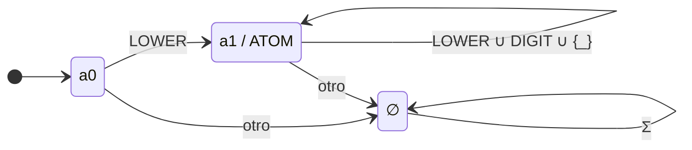
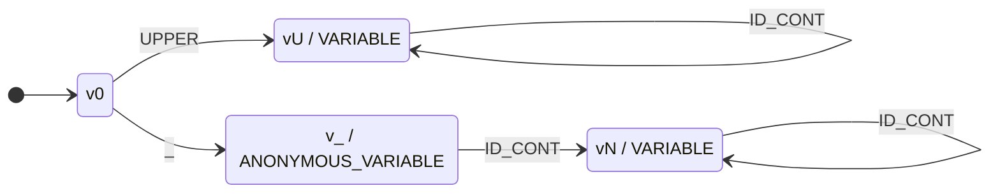
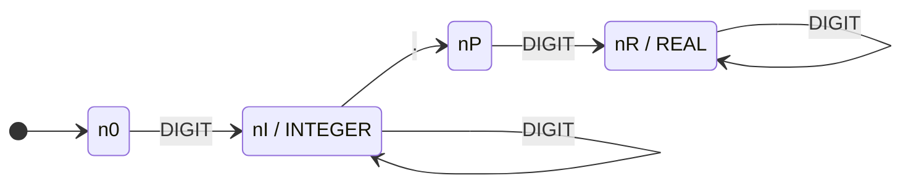
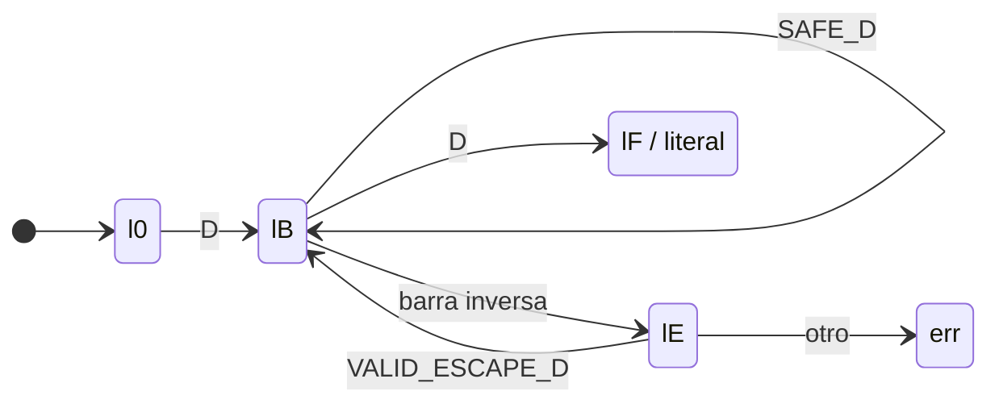
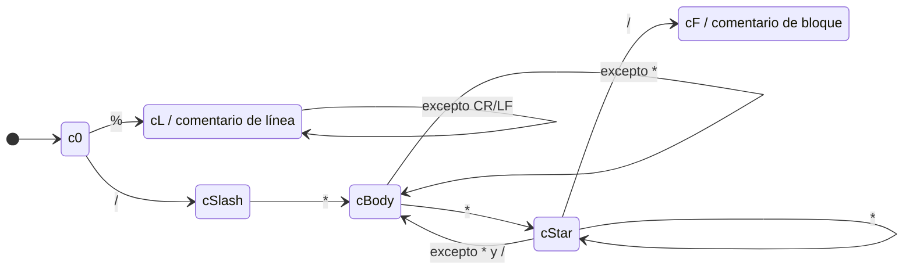
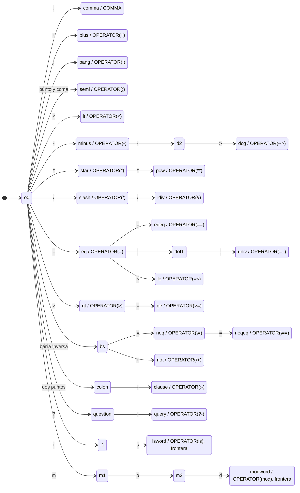

# Autómatas principales

## 1. Alcance formal

Cada expresión regular del contrato denota un lenguaje regular. Las
construcciones de este documento dan un autómata finito para cada categoría y,
por equivalencia entre expresiones regulares y autómatas finitos, prueban que
las categorías modeladas son regulares. Los delimitadores restantes son
lenguajes unitarios y se reconocen con una transición desde el estado inicial a
un estado aceptor.

Los autómatas reconocen un lexema completo. El lexer los ejecuta desde el cursor
y decide cuándo termina el lexema mediante máxima coincidencia, como se explica
en el segundo documento. Los estados `err` que aparecen en algunos diagramas
ayudan a describir diagnósticos. No son aceptores.

## 2. Átomos no entrecomillados

La expresión contractual es `LOWER (LOWER ∪ DIGIT ∪ {_})*`, equivalente
a `[a-z][a-z0-9_]*`.

El AFD es `M_A = (Q_A, Σ_A, δ_A, a0, F_A)`:

- `Q_A = {a0, a1, ∅}`;
- `Σ_A` es el alfabeto de entrada;
- `a0` es el estado inicial;
- `F_A = {a1}`, etiquetado `ATOM`;
- `C_A = LOWER ∪ DIGIT ∪ {_}`.

| Estado | `LOWER` | `DIGIT` o `_` | otro símbolo | Aceptación |
|---|---|---|---|---|
| `a0` | `a1` | `∅` | `∅` | No |
| `a1` | `a1` | `a1` | `∅` | `ATOM` |
| `∅` | `∅` | `∅` | `∅` | No |

La tabla separa `LOWER` de `DIGIT` y `_` porque solo una minúscula puede iniciar
el lexema. Una mayúscula tampoco pertenece a `C_A`, de acuerdo con la especificación léxica.

[Fuente Mermaid de la figura 1](diagramas/atomos.mmd)



`padre`, `a` y `persona_1` terminan en `a1`. `Padre`, `_a` y `9a` terminan en
`∅`. Los tres estados son distinguibles: `a1` acepta la cadena vacía restante,
`a0` no la acepta pero admite una continuación minúscula, y `∅` no admite
ninguna continuación que lleve a aceptar. Por eso el AFD total es mínimo.

## 3. Variables y variable anónima

La unión que debe reconocerse es:

```text
UPPER ID_CONT*  |  _ ID_CONT+  |  _
```

El AFD etiquetado es `M_V = (Q_V, Σ_V, δ_V, v0, F_V)`, con
`Q_V = {v0, vU, v_, vN, ∅}` y
`F_V = {vU, v_, vN}`. Las etiquetas de aceptación son `VARIABLE` para `vU` y
`vN`, y `ANONYMOUS_VARIABLE` para `v_`.

| Estado | `UPPER` | `_` | `LOWER` o `DIGIT` | otro | Aceptación |
|---|---|---|---|---|---|
| `v0` | `vU` | `v_` | `∅` | `∅` | No |
| `vU` | `vU` | `vU` | `vU` | `∅` | `VARIABLE` |
| `v_` | `vN` | `vN` | `vN` | `∅` | `ANONYMOUS_VARIABLE` |
| `vN` | `vN` | `vN` | `vN` | `∅` | `VARIABLE` |
| `∅` | `∅` | `∅` | `∅` | `∅` | No |

[Fuente Mermaid de la figura 2](diagramas/variables.mmd)



`X`, `Persona` y `_1` se aceptan como `VARIABLE`; `_` se acepta en `v_` como
`ANONYMOUS_VARIABLE`; `9X` se rechaza. El prefijo `_` es a la vez un lexema
completo y el comienzo de variables como `_Tmp`. El reconocimiento formal
mantiene ambas posibilidades mediante dos estados aceptores consecutivos. La
tokenización elige `_Tmp` porque es más largo. Si el cursor ve solo `_`, la regla
de anónima gana. La prioridad declarada para `_` funciona como desempate de
clasificación, aunque estas dos expresiones concretas no empatan en longitud.

Esto separa dos asuntos: el lenguaje aceptado contiene tanto `_` como `_Tmp`;
la política del lexer asigna a cada lexema su token contractual.

## 4. Enteros y reales

Las expresiones son `DIGIT+` para `INTEGER` y `DIGIT+ \. DIGIT+` para `REAL`.
Se modelan juntas para hacer visible el prefijo común:

`M_N = (Q_N, Σ_N, δ_N, n0, F_N)`, donde
`Q_N = {n0, nI, nP, nR, ∅}` y `F_N = {nI, nR}`. `nI` lleva la etiqueta
`INTEGER` y `nR` la etiqueta `REAL`.

| Estado | `DIGIT` | `.` | `+` o `-` | otro | Aceptación |
|---|---|---|---|---|---|
| `n0` | `nI` | `∅` | `∅` | `∅` | No |
| `nI` | `nI` | `nP` | `∅` | `∅` | `INTEGER` |
| `nP` | `nR` | `∅` | `∅` | `∅` | No |
| `nR` | `nR` | `∅` | `∅` | `∅` | `REAL` |
| `∅` | `∅` | `∅` | `∅` | `∅` | No |

[Fuente Mermaid de la figura 3](diagramas/numeros.mmd)



Recorridos representativos:

| Entrada | Recorrido | Resultado formal |
|---|---|---|
| `25` | `n0 → nI → nI` | `INTEGER` |
| `3.14` | `n0 → nI → nP → nR → nR` | `REAL` |
| `5.` | `n0 → nI → nP` | Rechazo, termina en estado no aceptor |
| `.5` | `n0 → ∅` | Rechazo |
| `1.2.3` | llega a `nR` y el segundo `.` lleva a `∅` | Rechazo |
| `-12` | `-` lleva a `∅` | No es un solo número |

El lexer aplica además la regla de recuperación del contrato: una corrida
contigua de dígitos y puntos que empieza por dígito, o por `.` seguido de
dígito, y que no pertenece a ninguno de los dos lenguajes produce
`MALFORMED_NUMBER`. Así no fragmenta `5.` ni `.5` en tokens aparentemente
válidos. `+` y `-` pertenecen al autómata de operadores, nunca a `M_N`.

## 5. Literales entrecomillados

Se usa un esquema parametrizado por el delimitador `D`. Para `QUOTED_ATOM`,
`D = '` y `VALID_ESCAPE_D = {\\, ', n, r, t}` después de una barra inversa.
Para `STRING`, `D = "` y `VALID_ESCAPE_D = {\\, ", n, r, t}`. `SAFE_D` es
cualquier carácter salvo `D`, barra inversa, `\r` o `\n`.

Para cada delimitador se define el AFD
`M_L(D) = (Q_L, Σ_L, δ_L, l0, {lF})`, con
`Q_L = {l0, lB, lE, lF, err}`. `lF` se etiqueta `QUOTED_ATOM` o `STRING`.
Las transiciones relevantes son:

| Origen | Condición de entrada | Destino |
|---|---|---|
| `l0` | delimitador `D` | `lB` |
| `lB` | un carácter de `SAFE_D` | `lB` |
| `lB` | barra inversa | `lE` |
| `lB` | delimitador `D` | `lF` |
| `lE` | un carácter de `VALID_ESCAPE_D` | `lB` |
| `lE` | cualquier otro carácter | `err` |
| `lB` o `lE` | salto real o EOF | `err` |
| `lF` o `err` | cualquier carácter adicional | `err` |

La comilla delimitadora pertenece a `VALID_ESCAPE_D` cuando aparece justo
después de la barra inversa. Un escape desconocido entra en `err` y causa
`INVALID_ESCAPE`. EOF o salto real desde `lB` o `lE` causa el error de literal
sin cierre.

[Fuente Mermaid de la figura 4](diagramas/literales.mmd)



`'it\'s'` y `"dice: \"sí\""` llegan a `lF`. `'a\q'`, `"a\'b"` y un
literal sin cierre no llegan a un estado aceptor. Los símbolos `%`, `/*` y `*/`
dentro de `lB` pertenecen a `SAFE_D`; por eso no activan los autómatas de
comentarios.

## 6. Comentarios

### 6.1 Comentario de línea

El AFD `M_CL` tiene estados `{c0, cL, ∅}`, inicial `c0` y aceptor `cL`.
La transición `c0 --%--> cL` reconoce el inicio y `cL` tiene un bucle con todo
símbolo salvo `\r` y `\n`. El lexema `%` es un comentario válido incluso si
aparece justo antes de EOF. El salto no forma parte del comentario y lo consume
la regla de espacios.

### 6.2 Comentario de bloque

El AFD `M_CB = (Q_CB, Σ_CB, δ_CB, c0, {cF})` usa
`Q_CB = {c0, cSlash, cBody, cStar, cF, ∅}`.

| Estado | `/` | `*` | otro símbolo | Aceptación |
|---|---|---|---|---|
| `c0` | `cSlash` | `∅` | `∅` | No |
| `cSlash` | `∅` | `cBody` | `∅` | No |
| `cBody` | `cBody` | `cStar` | `cBody` | No |
| `cStar` | `cF` | `cStar` | `cBody` | No |
| `cF` | `∅` | `∅` | `∅` | Comentario de bloque |

[Fuente Mermaid de la figura 5](diagramas/comentarios.mmd)



`/* x */` termina en `cF`. `/* x` alcanza EOF en `cBody`, que no acepta. El
autómata no acepta un comentario incompleto; el lexer detecta que comenzó con
`/*`, informa `UNTERMINATED_BLOCK_COMMENT` y consume hasta EOF. Esta
recuperación no agrega una transición de aceptación.

## 7. Trie de operadores y signos

El conjunto finito de lexemas se reconoce con un trie determinista. Cada ruta
parte de `o0`, consume un carácter por arista y termina en un estado etiquetado.
Los estados aceptores que también son prefijos, como `/`, `*`, `-`, `=` y `\=`,
pueden seguir avanzando. El lexer conserva la última aceptación alcanzada y
aplica máxima coincidencia.

Formalmente, el trie de candidatos es
`M_O = (Q_O, Σ_O, δ_O, o0, F_O)`. `Q_O` contiene `o0`, cada prefijo propio,
sus hojas y el estado muerto. `Σ_O` contiene los caracteres que aparecen en los
lexemas: letras de `is` y `mod`, `,`, `+`, `-`, `*`, `/`, `=`, `.`, `<`, `>`,
`\`, `!`, `;`, `:` y `?`. `F_O` contiene los estados cuya etiqueta incluye
`OPERATOR` y la hoja `COMMA`. La función `δ_O` es la arista del trie
correspondiente; cualquier arista ausente conduce al estado muerto.

Las hojas `isword` y `modword` son aceptaciones provisionales del candidato
exacto. La frontera no forma parte de `δ_O` ni del lexema. La estrategia
integrada valida, sin consumir, el carácter `c` que sigue al candidato:

```text
BOUNDARY(c) = c = EOF  o  c ∉ ID_CONT
```

Solo conserva `isword` o `modword` si `BOUNDARY(c)` es verdadera. Esta es la
guarda de contexto derecho de la expresión regular contractual. También puede
implementarse con un estado no aceptor de bloqueo y un carácter de anticipación
que luego se devuelve al flujo. En ambos casos se necesita memoria finita y no
se amplía el lenguaje regular.

[Fuente Mermaid de la figura 6](diagramas/operadores.mmd)



La figura agrupa hojas de un carácter para mantenerla legible. La tabla siguiente
es la definición completa de las rutas y de su salida:

| Ruta desde `o0` | Aceptaciones encontradas | Salida final por máxima coincidencia |
|---|---|---|
| `,` | `,` | `COMMA`, no `OPERATOR` |
| `+`, `!`, `;`, `<` | el propio carácter | `OPERATOR` |
| `-`, `--`, `-->` | `-`; luego ninguna en `--`; luego `-->` | `OPERATOR('-')` o `OPERATOR('-->')` |
| `*`, `**` | `*`, `**` | `OPERATOR` más largo |
| `/`, `//` | `/`, `//` | `OPERATOR` más largo, salvo que `/*` inicie comentario |
| `=`, `==`, `=..`, `=<` | `=`, `==`, `=..`, `=<` | `OPERATOR` más largo |
| `>`, `>=` | `>`, `>=` | `OPERATOR` más largo |
| `\=`, `\==`, `\+` | `\=`, `\==`, `\+` | `OPERATOR`; `\` aislada no acepta |
| `:-`, `?-` | solo el lexema completo | `OPERATOR`; `:` y `?` aislados no aceptan |

La coma se incluye porque el enunciado pide mostrar esa rama junto a los
operadores. La especificación léxica la clasifica como `COMMA`, y este documento
conserva esa clasificación. Del mismo modo, antes de entrar en la rama `/`, el
lexer prueba el comentario de bloque para que `/*` no se divida en dos
operadores.

`is` y `mod` usan dos ramas adicionales de palabra completa:

```text
o0 -i-> i1 -s-> is_accept
o0 -m-> m1 -o-> m2 -d-> mod_accept
```

`isword` y `modword` solo se confirman si el siguiente carácter no pertenece a
`ID_CONT`. Esto equivale a la guarda `(?![A-Za-z0-9_])` del contrato. En `isla`,
el candidato operador se invalida por la `l`, mientras el AFD de `ATOM` consume
los cuatro caracteres. El resultado es `ATOM('isla')`, no `OPERATOR('is')`
seguido de `ATOM('la')`. En `is`, ambos candidatos tienen longitud dos y la
prioridad de palabra operadora elige `OPERATOR`. `mod` y `modulo` se resuelven
de la misma forma.

Las ramas etiquetadas `OPERATOR` conservan la familia indicada en el contrato:
`CLAUSE`, `QUERY`, `DCG`, `UNIFICATION_COMPARISON`, `ARITHMETIC` o `CONTROL`.
