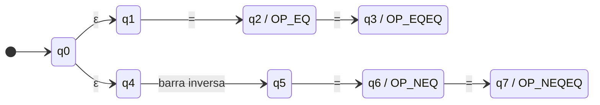
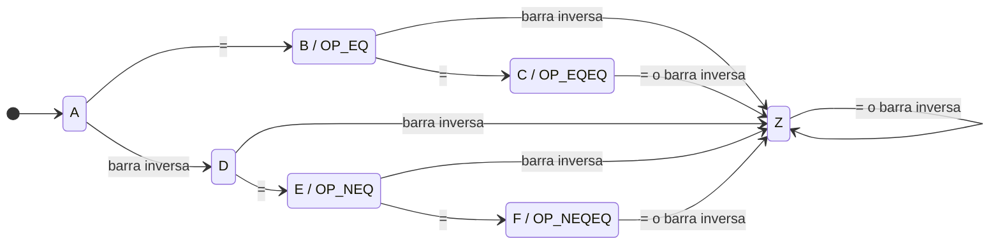

# Determinización, minimización y estrategia integrada

## 1. Estrategia equivalente a un AFD integrado

Se adopta una familia de autómatas o expresiones regulares por categoría con
simulación paralela conceptual. Es preferible a dibujar un AFD monolítico porque
conserva visibles las reglas del contrato, pero toma la misma decisión que un AFD
integrado con aceptaciones etiquetadas.

En cada posición, el procedimiento es:

1. Guardar el índice actual como inicio del siguiente lexema.
2. Calcular todos los candidatos válidos que comienzan exactamente en ese índice.
3. Conservar solo los candidatos de mayor longitud.
4. Si hay empate, aplicar la prioridad contractual.
5. Emitir el token ganador, o ignorar el candidato si es espacio o comentario, y
   avanzar tantos caracteres como mida el lexema.
6. Si no existe candidato, generar el error correspondiente, consumir el
   fragmento definido por la recuperación y continuar.

La equivalencia se obtiene construyendo un AFN nuevo con un estado inicial y una
transición `ε` al inicio de cada autómata de categoría. La construcción de
subconjuntos produce un AFD cuyos estados representan todos los reconocedores
activos tras cada prefijo. Guardar la última aceptación durante el recorrido
implementa máxima coincidencia. Etiquetar cada aceptación con una prioridad
resuelve de forma determinista los empates. Por tanto, la estrategia separada y
el AFD integrado observan los mismos prefijos, recuerdan las mismas aceptaciones
y emiten el mismo token.

Los detectores de `MALFORMED_NUMBER`, escape inválido y comentario sin cierre
participan antes de la recuperación genérica. No convierten una cadena rechazada
en un token aceptado; solo eligen el diagnóstico y cuánto texto descartar.

## 2. Tabla de prioridades

La longitud manda antes que cualquier fila de esta tabla. La prioridad solo
interviene cuando dos candidatos consumen el mismo número de caracteres, o
cuando un detector de error contractual debe impedir una fragmentación
engañosa.

| Orden | Candidato preferido | Candidato desplazado | Motivo |
|---:|---|---|---|
| 1 | Comentario de bloque `/*...*/` | `/` y `*` | Los comentarios son ignorables completos. |
| 2 | Detector de comentario sin cierre | `/`, `*` y contenido posterior | Produce `UNTERMINATED_BLOCK_COMMENT`. |
| 3 | Literal cerrado o su detector específico de error | tokens internos aparentes | El contenido se procesa dentro del delimitador. |
| 4 | Detector `MALFORMED_NUMBER` | `INTEGER` y `DOT` parciales | `5.`, `.5`, `1.2.3` y el sufijo inválido de `12abc` son un error cada uno. |
| 5 | Operador largo | su prefijo corto | Cubre `\==`, `=..`, `==`, `=<`, `>=`, `:-`, `?-`, `//`, `**`, `\+` y `-->`. |
| 6 | `REAL` | `INTEGER` sobre el mismo prefijo | En la práctica `REAL` gana por longitud. |
| 7 | `VARIABLE` iniciada por `_` | `_` | `_Tmp` gana por longitud. |
| 8 | `ANONYMOUS_VARIABLE` | regla general de variable | Clasifica `_` aislado; la regla general exige continuación. |
| 9 | `OPERATOR('is')` o `OPERATOR('mod')` | `ATOM` de igual longitud | Son palabras operadoras completas. |

Las guardas de palabra excluyen `is` y `mod` como candidatos operadores cuando
les sigue `ID_CONT`. Así `isla` y `modulo` no dependen de un corte posterior ni
se dividen. Los operadores largos restantes suelen resolverse por longitud; su
orden en la tabla de reglas es una defensa adicional para implementaciones que
prueban alternativas secuencialmente.

## 3. AFN representativo

Se determiniza el lenguaje finito `{=, ==, \=, \==}`. Para conservar el token
exacto durante la minimización, las aceptaciones se etiquetan `OP_EQ`,
`OP_EQEQ`, `OP_NEQ` y `OP_NEQEQ`. La implementación puede mapear las cuatro a
`OPERATOR` con familia `UNIFICATION_COMPARISON`, pero conserva el lexema
original.

El AFN es `N = (Q, Σ, q0, F, Δ)`:

```text
Q = {q0, q1, q2, q3, q4, q5, q6, q7}
Σ = {=, \}
F = {q2:OP_EQ, q3:OP_EQEQ, q6:OP_NEQ, q7:OP_NEQEQ}
```

Las transiciones no indicadas producen el conjunto vacío.

| Estado | `ε` | `=` | `\` | Aceptación |
|---|---|---|---|---|
| `q0` | `{q1, q4}` | `∅` | `∅` | No |
| `q1` | `∅` | `{q2}` | `∅` | No |
| `q2` | `∅` | `{q3}` | `∅` | `OP_EQ` |
| `q3` | `∅` | `∅` | `∅` | `OP_EQEQ` |
| `q4` | `∅` | `∅` | `{q5}` | No |
| `q5` | `∅` | `{q6}` | `∅` | No |
| `q6` | `∅` | `{q7}` | `∅` | `OP_NEQ` |
| `q7` | `∅` | `∅` | `∅` | `OP_NEQEQ` |

[Fuente Mermaid de la figura 7](diagramas/afn_operadores.mmd)



## 4. Construcción de subconjuntos

Para un conjunto `S` y símbolo `a`, se aplica:

```text
move(S, a) = ⋃ { Δ(q, a) | q ∈ S }
Dtran(S, a) = ε-cerradura(move(S, a))
```

La cerradura inicial es:

```text
ε-cerradura({q0}) = {q0, q1, q4} = A
```

Un cálculo completo desde `A` con `=` queda así:

```text
move(A, =)
  = Δ(q0, =) ∪ Δ(q1, =) ∪ Δ(q4, =)
  = ∅ ∪ {q2} ∪ ∅
  = {q2}

Dtran(A, =)
  = ε-cerradura({q2})
  = {q2}
  = B
```

El otro prefijo se calcula de la misma manera:

```text
move(A, \) = ∅ ∪ ∅ ∪ {q5} = {q5}
ε-cerradura({q5}) = {q5} = D
```

Después de la cerradura inicial no aparecen nuevas transiciones `ε`, de modo
que cada cerradura posterior coincide con el conjunto obtenido por `move`.
Los cálculos restantes, incluida cada transición al conjunto vacío, son:

```text
Dtran(B, =) = ε-cerradura(Δ(q2, =)) = ε-cerradura({q3}) = C
Dtran(B, \) = ε-cerradura(Δ(q2, \)) = ε-cerradura(∅) = Z

Dtran(C, =) = ε-cerradura(Δ(q3, =)) = ε-cerradura(∅) = Z
Dtran(C, \) = ε-cerradura(Δ(q3, \)) = ε-cerradura(∅) = Z

Dtran(D, =) = ε-cerradura(Δ(q5, =)) = ε-cerradura({q6}) = E
Dtran(D, \) = ε-cerradura(Δ(q5, \)) = ε-cerradura(∅) = Z

Dtran(E, =) = ε-cerradura(Δ(q6, =)) = ε-cerradura({q7}) = F
Dtran(E, \) = ε-cerradura(Δ(q6, \)) = ε-cerradura(∅) = Z

Dtran(F, =) = ε-cerradura(Δ(q7, =)) = ε-cerradura(∅) = Z
Dtran(F, \) = ε-cerradura(Δ(q7, \)) = ε-cerradura(∅) = Z

Dtran(Z, =) = ε-cerradura(∅) = Z
Dtran(Z, \) = ε-cerradura(∅) = Z
```

Todos los subconjuntos alcanzables son:

| Nombre | Subconjunto del AFN | Etiqueta de aceptación |
|---|---|---|
| `A` | `{q0, q1, q4}` | No |
| `B` | `{q2}` | `OP_EQ` |
| `C` | `{q3}` | `OP_EQEQ` |
| `D` | `{q5}` | No |
| `E` | `{q6}` | `OP_NEQ` |
| `F` | `{q7}` | `OP_NEQEQ` |
| `Z` | `∅` | No, estado muerto |

La tabla completa del AFD resultante es:

| Estado | `=` | `\` | Aceptación |
|---|---|---|---|
| `A` | `B` | `D` | No |
| `B` | `C` | `Z` | `OP_EQ` |
| `C` | `Z` | `Z` | `OP_EQEQ` |
| `D` | `E` | `Z` | No |
| `E` | `F` | `Z` | `OP_NEQ` |
| `F` | `Z` | `Z` | `OP_NEQEQ` |
| `Z` | `Z` | `Z` | No |

[Fuente Mermaid de la figura 8](diagramas/afd_subconjuntos.mmd)



Ningún subconjunto alcanzable contiene más de un estado aceptor. En la
construcción integrada general sí puede ocurrir. En ese caso se descartan primero
las aceptaciones anteriores al final del lexema, por máxima coincidencia, y si
varias etiquetas aceptan en el mismo índice gana la de menor número en la tabla
de prioridades.

## 5. Minimización del AFD etiquetado

Los siete estados de la tabla son alcanzables desde `A`:

```text
A: ε
B: =
C: ==
D: \
E: \=
F: \==
Z: =\
```

No se elimina ninguno. La minimización se aplica al AFD como transductor de
tokens, no solo como reconocedor booleano. Dos estados aceptores con etiquetas
distintas no son equivalentes porque producirían resultados distintos para la
misma entrada restante vacía.

La partición inicial separa no aceptores y cada salida observable:

```text
P0 = {
  {A, D, Z},
  {B}, {C}, {E}, {F}
}
```

Sobre los bloques de `P0`, las firmas de los estados no aceptores son:

| Estado | con `=` | con `\` | Firma por bloques de `P0` |
|---|---|---|---|
| `A` | `{B}` | `{A,D,Z}` por `D` | `({B}, {A,D,Z})` |
| `D` | `{E}` | `{A,D,Z}` por `Z` | `({E}, {A,D,Z})` |
| `Z` | `{A,D,Z}` por `Z` | `{A,D,Z}` por `Z` | `({A,D,Z}, {A,D,Z})` |

Las tres firmas difieren, así que el primer bloque se refina por completo:

```text
P1 = {
  {A}, {D}, {Z},
  {B}, {C}, {E}, {F}
}
```

`P1` ya es estable. No quedan dos estados en un mismo bloque y, por tanto, el
AFD mínimo etiquetado tiene siete estados. Su tabla y su diagrama coinciden con
los del AFD determinizado de la sección anterior.

La distinción por salida importa. `C` y `F` tienen transiciones futuras iguales,
pero la cadena restante `ε` exige `OP_EQEQ` en `C` y `OP_NEQEQ` en `F`.
Fusionarlos perdería la etiqueta. Lo mismo vale para cualquier par de estados
aceptores con tokens distintos. Si se olvidaran las etiquetas y solo interesara
aceptar la unión de los cuatro lexemas, `C` y `F` serían equivalentes, al igual
que `B` y `E`. Esa minimización reconoce el mismo conjunto de cadenas, pero ya no
es suficiente como clasificador léxico.

[Fuente Mermaid de la figura 9](diagramas/afd_minimo.mmd)


## 6. Comprobación de recorridos y preservación del lenguaje

| Cadena | AFN: rama posible | AFD: recorrido | Resultado |
|---|---|---|---|
| `=` | `q0 ε q1 = q2` | `A = B` | `OP_EQ` |
| `==` | `q0 ε q1 = q2 = q3` | `A = B = C` | `OP_EQEQ` |
| `\=` | `q0 ε q4 \ q5 = q6` | `A \ D = E` | `OP_NEQ` |
| `\==` | `q0 ε q4 \ q5 = q6 = q7` | `A \ D = E = F` | `OP_NEQEQ` |
| `\` | termina en `q5`, no aceptor | `A \ D` | Rechazo |
| `===` | no hay transición tras `q3` | `A = B = C = Z` | Rechazo como lexema completo |

Cada cadena aceptada por el AFN llega en el AFD a un subconjunto que contiene el
mismo estado aceptor. A la inversa, cada estado contenido en un subconjunto del
AFD corresponde a un recorrido posible del AFN. La construcción de subconjuntos
preserva así el lenguaje. La refinación no fusionó estados, por lo que la
minimización preserva además cada etiqueta de salida.

En una entrada continua, `===` no necesita tratarse como un operador de tres
caracteres: el lexer recuerda `C` como última aceptación, emite `==`, vuelve a
`A` y reconoce el `=` restante. Esta conducta es distinta de pedir que `===` sea
un lexema completo del lenguaje representativo.

## 7. Generalización

Para el conjunto completo se repite el mismo procedimiento:

1. unir con `ε` los autómatas de categoría;
2. calcular solo los subconjuntos alcanzables;
3. etiquetar cada subconjunto aceptor con el token prioritario;
4. completar transiciones con un estado muerto;
5. separar primero las particiones por salida de token;
6. refinar por el destino de cada clase de símbolo hasta alcanzar una partición
   estable.

El número de clases de símbolos aumenta, pero no cambia el argumento. Las
expresiones regulares, los autómatas por categoría y el AFD integrado reconocen
los mismos lenguajes; máxima coincidencia y prioridad convierten esas
aceptaciones en una secuencia única de tokens.

## 8. Lista de verificación contractual

- `ATOM` usa exactamente `[a-z][A-Za-z0-9_]*`.
- `VARIABLE` y `ANONYMOUS_VARIABLE` separan `_` de `_` con continuación.
- `INTEGER` y `REAL` no incluyen signo y exigen dígitos a ambos lados del punto
  real.
- Los dos tipos de literal aceptan solo sus escapes contractuales y exigen cierre.
- El comentario de bloque acepta solo después del primer `*/`; EOF antes del
  cierre es recuperación por error.
- El trie contiene los operadores de uno y varios caracteres del contrato, además
  de la rama `COMMA` solicitada.
- `is` y `mod` exigen frontera de palabra y ganan el empate exacto con `ATOM`.
- La determinización y la minimización mantienen lenguaje y etiquetas.

## 9. Fuentes usadas

La notación y el procedimiento siguen las fuentes exigidas para esta etapa:

1. `Tarea INFO1148 sem2_2026.pdf`, apartados 3, 4 y 10.
2. Las instrucciones de trabajo proporcionadas externamente durante la preparación.
3. `docs/informe/01_especificacion_lexica.md`, contrato léxico del proyecto.
4. `../teoria-computacion/clases/semana3/sesion3_TC.pdf`, definición de AFN,
   transiciones `ε` y `ε`-cerradura.
5. `../teoria-computacion/clases/semana3/sesion4_Lenguajes_Regulares.html`,
   equivalencia entre lenguajes regulares, expresiones regulares y autómatas.
6. `../teoria-computacion/tareas/Formato Informe Tarea.pdf`, secciones sugeridas
   para diseño, determinización y minimización.
